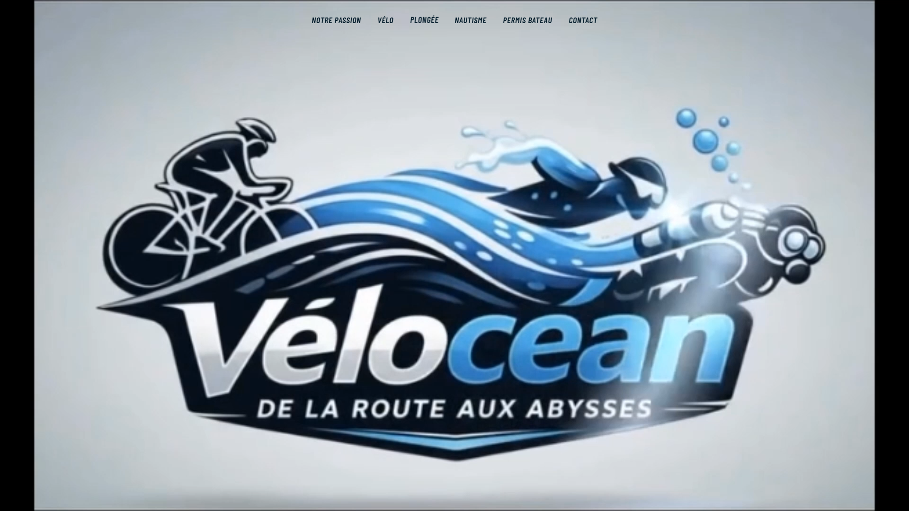
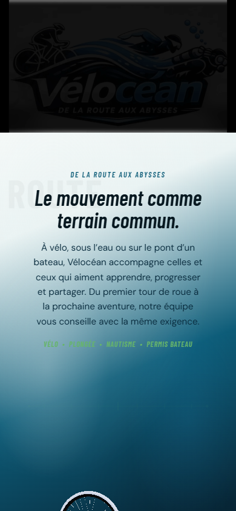

<div align="center">

# 🌊 Vélocéan

### De la route aux abysses
**Sportif · Immersif · Responsive · Accessible**

[](https://spiritzen.github.io/portfolio/)
[](https://github.com/Spiritzen)
[](https://www.linkedin.com/in/sebastien-cantrelle-26b695106/)

[](https://react.dev/)
[](https://www.typescriptlang.org/)
[](https://vite.dev/)
[](https://threejs.org/)
[](https://r3f.docs.pmnd.rs/)
[](https://vitest.dev/)
[](https://eslint.org/)

**Déploiement GitHub Pages à venir** — adresse prévue : `https://spiritzen.github.io/velocean/` (non active tant que non vérifiée)

</div>

---

## ⚠️ Ce projet en une phrase

Vélocéan est une **proposition de site vitrine immersif**, réalisée à titre de démonstration technique et artistique par Sébastien Cantrelle. Ce n'est **pas** un site officiel commandé ou validé par l'entreprise Vélocéan — voir la section [Nature de la démonstration](#️-nature-de-la-démonstration) pour le détail complet.

---

## 🎯 Objectif du projet

- Servir de **démonstrateur commercial** pour la prospection auprès d'acteurs du vélo, de la plongée et du nautisme.
- Proposer une **expérience de marque immersive**, mêlant vidéo, 3D et direction artistique cohérente plutôt qu'un site vitrine générique.
- Mettre en valeur un savoir-faire fictif de **conseil technique, de sécurité et de partage familial** autour de quatre activités : vélo, plongée, nautisme et permis bateau.
- Démontrer une intégration **responsive du mobile au grand écran**, sans compromis sur l'accessibilité ni la performance.
- Servir de vitrine technique aux compétences de Sébastien : **direction artistique, React/TypeScript, animation CSS, 3D Web**.

---

## 🖼 Aperçu

| Desktop | Mobile |
|---|---|
|  |  |

*Captures réalisées en local sur le build de développement, après validation visuelle manuelle.*

---

## ✨ Expérience proposée

- **Hero vidéo** en lecture automatique, sans contrôles visibles, qui se fige sur sa dernière image — recadrée nativement en portrait sur mobile pour ne rien perdre du cadrage.
- **Navigation cinétique** : la barre de navigation se révèle en rythme avec la lecture de la vidéo (avec filet de secours temporel), puis reste accessible en scroll ; menu mobile en panneau accessible (focus géré, fermeture au clavier via `Échap`).
- **Section « Notre passion »** : une roue de vélo en 3D, tournant sur son axe puis traversant la scène en diagonale au fil du scroll, avec deux blocs éditoriaux qui se répondent.
- **Quatre sections métier** — Vélo, Plongée, Nautisme, Permis bateau — construites sur un composant unique, alternant image/texte, avec preuves concrètes et appel à l'action vers le contact.
- **Témoignages** qui rejouent leur animation (entrée alternée, étoiles en cascade) à chaque retour dans le viewport, jamais une seule fois figée.
- **Contact** : coordonnées, horaires, lien d'itinéraire, et formulaire qui prépare un e-mail via `mailto:` — sans aucun backend.
- **Footer** avec rappel des activités, mentions légales/CGU/CGV en dialogues accessibles rappelant explicitement la nature de démonstration, et lien Instagram.

---

## 🛞 Une narration 3D au scroll

La section « Notre passion » est portée par **Three.js**, piloté depuis React via **React Three Fiber**. Un modèle **GLB optimisé** de roue de vélo tourne sur son axe puis traverse la scène en diagonale, avec un changement d'échelle qui donne une impression d'approche progressive — le tout **réversible** : remonter dans la page rejoue la trajectoire en sens inverse, sans saut ni à-coup.

Cette scène n'est jamais un poids mort pour le reste du site :

- le **chunk 3D** (`WheelSceneCanvas`, Three.js et React Three Fiber inclus) est chargé en *lazy loading* via `React.lazy`/`Suspense`, uniquement lorsque la section approche du viewport ;
- une **détection de support WebGL** (`supportsWebGL`) empêche de monter le canvas sur un navigateur/device incapable d'en créer le contexte — la section et ses deux blocs de texte restent affichés dans tous les cas ;
- une **`ErrorBoundary` dédiée** (`SceneErrorBoundary`) isole toute erreur runtime de la scène (GLB introuvable, perte de contexte GL…) pour qu'elle ne fasse jamais tomber le reste de la page ;
- en `prefers-reduced-motion`, la roue est présentée **statique**, sans animation de trajectoire.

---

## 🛠 Stack technique

| Besoin | Technologie | Détail |
|---|---|---|
| Framework UI | React | `19.2.8` |
| Langage | TypeScript | `5.9.3`, mode strict |
| Build / dev server | Vite | `7.3.6` |
| Style | CSS Modules | pas de framework CSS, variables `--css` par composant |
| Scène 3D | Three.js | `0.185.1` |
| Intégration 3D ↔ React | React Three Fiber | `9.7.0` |
| Icônes | lucide-react | `1.34.0` |
| Polices | @fontsource (Barlow Condensed, DM Sans) | auto-hébergées, aucune requête externe |
| Tests unitaires / composants | Vitest + Testing Library | `4.1.11` / `16.3.2` |
| Environnement de test | jsdom | `27.4.0` |
| Qualité de code | ESLint (config plate) + typescript-eslint | `10.9.1` / `8.68.0` |

Aucun backend, aucune base de données, aucun tracker ou script analytique tiers : le projet est **100 % statique et front-end**.

---

## 🏗 Architecture

```
src/
├── app/                    # Racine applicative (App.tsx)
├── pages/
│   └── HomePage/           # Assemblage de toutes les sections, dans l'ordre final
├── components/
│   ├── layout/              # Header (nav cinétique + menu mobile), Footer
│   ├── sections/
│   │   ├── HeroSection/      # Vidéo d'accroche
│   │   ├── WheelJourneySection/  # Section 3D « Notre passion » (scène, maths, textes)
│   │   ├── ActivitySection/  # Composant réutilisable Vélo/Plongée/Nautisme/Permis bateau
│   │   ├── TestimonialsSection/  # Avis clients, animation rejouable
│   │   └── ContactSection/   # Coordonnées, horaires, itinéraire, formulaire
│   ├── forms/
│   │   └── ContactForm/      # Formulaire contrôlé, validation native, mailto
│   ├── ui/
│   │   └── LegalDialog/      # Dialogue accessible (mentions légales, CGU, CGV)
│   └── icons/                 # Icônes locales (ex. Instagram, absente de lucide-react)
├── data/                    # Contenus typés : navigation, activités, témoignages, contact, mentions
├── hooks/                   # useInView, usePrefersReducedMotion, useScrollThreshold, useHeroVideoReveal
├── lib/                     # Fonctions pures : publicAsset (URLs), buildContactMailto
├── styles/                  # Tokens CSS globaux et styles de base
└── test/                    # Configuration Vitest/jsdom (setup.ts)

public/
├── images/                 # Photos WebP des quatre activités
├── videos/                 # Vidéo hero
├── models/                 # Modèle GLB de la roue 3D
└── favicon.svg
```

La séparation `layout` / `sections` / `forms` / `ui` / `data` / `hooks` / `lib` reflète l'organisation réelle du code : aucune logique métier n'est mélangée aux composants de présentation, et les fonctions sensibles (construction d'URL d'assets, construction du `mailto:`) sont extraites en fonctions pures testées indépendamment.

---

## ♿ Accessibilité et qualité

Garanties réellement vérifiées dans le code et par les tests :

- Structure sémantique `header` / `main` / `section` / `footer`, un seul `<h1>` sur la page, `<h2>` pour chaque section.
- Navigation clavier complète : menu mobile en dialogue accessible (`role="dialog"`, `aria-modal`), fermeture au clavier (`Échap`) avec restitution du focus au bouton d'ouverture.
- Labels de formulaire toujours visibles (jamais de placeholder comme seul repère), validation HTML5 native avec messages accessibles, et un contour d'erreur qui n'apparaît qu'après interaction du champ concerné — jamais au chargement de la page.
- Cibles tactiles ≥ 44×44px sur les éléments interactifs.
- `prefers-reduced-motion` respecté sur l'ensemble des animations ajoutées (scène 3D, révélations de section, témoignages, navigation).
- Fallback WebGL : la section 3D reste utilisable (texte, mise en page) même sans support WebGL.
- Textes alternatifs descriptifs sur toutes les images de contenu.

---

## ⚡ Performance

- Images au format **WebP**, dimensions intrinsèques déclarées (`width`/`height`) pour éviter tout décalage de mise en page (CLS), chargées en **lazy loading** sous la ligne de flottaison.
- Scène 3D chargée en **code splitting** (chunk séparé, monté seulement à l'approche du scroll).
- Vidéo hero et modèle GLB **hébergés localement**, aucune dépendance à un CDN tiers.
- Polices auto-hébergées via `@fontsource`, sans requête vers Google Fonts ou autre service externe.

Aucun score Lighthouse n'est affirmé ici : ces points sont des choix d'implémentation vérifiables dans le code, pas une mesure publiée.

---

## 🚀 Installation locale

Prérequis : Node.js 20 LTS ou plus récent (développé et testé avec Node 22).

```bash
git clone https://github.com/Spiritzen/velocean.git
cd velocean
npm install
npm run dev
```

Commandes de validation disponibles :

```bash
npm run typecheck   # Vérification TypeScript stricte (tsc -b)
npm run test        # Suite de tests Vitest + Testing Library
npm run test:watch  # Suite de tests en mode watch
npm run lint        # ESLint
npm run build       # Build de production (tsc -b puis vite build)
npm run preview     # Prévisualisation locale du build de production
```

Au moment de la rédaction de ce README, la suite compte **74 tests répartis sur 13 fichiers**, tous verts.

---

## 📦 Déploiement

Le projet est **entièrement statique** après `npm run build` (dossier `dist/`) et peut être publié sur GitHub Pages, Netlify, Vercel ou Cloudflare Pages sans modification côté serveur.

GitHub Pages est l'hébergement **prévu** pour ce dépôt, mais n'est **pas encore activé**. Avant de déployer sur un sous-chemin de type `spiritzen.github.io/velocean/`, il faudra configurer l'option [`base`](https://vite.dev/config/shared-options.html#base) de Vite (actuellement absente de `vite.config.ts`, donc `/` par défaut) pour que les assets se résolvent correctement hors racine de domaine.

---

## ⚠️ Nature de la démonstration

- Ce site est un **prototype non officiel**, réalisé à l'initiative de Sébastien Cantrelle, et n'engage pas l'entreprise Vélocéan.
- **Textes, tarifs, coordonnées, horaires et témoignages sont fictifs ou indicatifs**, à valider et remplacer par les informations réelles avant toute mise en ligne au nom de Vélocéan.
- Le formulaire de contact **ne possède pas de backend** : il prépare un e-mail via un lien `mailto:` ouvert dans la messagerie du visiteur, sans jamais simuler un envoi réseau réussi.
- **Aucune donnée personnelle n'est collectée ni stockée** par le site — pas de base de données, pas de paiement, pas de tracker tiers.
- Aucune balise `noindex` n'est présente à ce jour dans `index.html` : à ajouter avant toute publication publique si ce démonstrateur ne doit pas être indexé par les moteurs de recherche.

---

## 👤 Auteur

**Sébastien Cantrelle**
Développeur Full Stack · Applications web et sites vitrines · Amiens, France

[Portfolio](https://spiritzen.github.io/portfolio/) · [LinkedIn](https://www.linkedin.com/in/sebastien-cantrelle-26b695106/) · [GitHub](https://github.com/Spiritzen)

*Vélocéan · Démonstration frontend · 2026*
